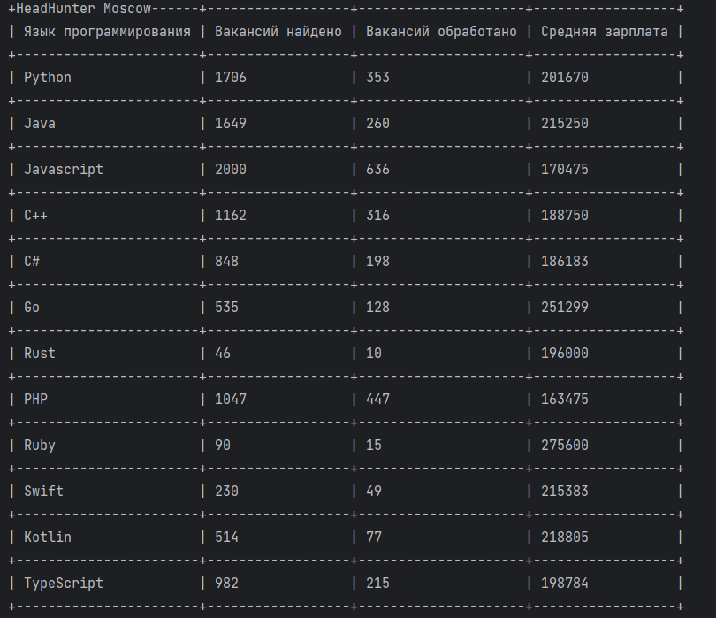

# Сравниваем вакансии программистов

Проект обращается к  сервисам [api HeadHunter](https://github.com/hhru/api/blob/master/docs/general.md)  и [SuperJob](https://api.superjob.ru/) по API, после чего в происходит сбор вакансий, вычисление среднейго значения зарплат, и вывод данных в виде таблицы.


### Как установить
Проект надо клонировать из репозитория.

В директории со скриптом создайте файл `.env`, в котором сохраните следующий параметр: `SJ_TOKEN= ваш токен`, полученный после регистрации на сайте superjob.ru
```shell
pip intall -r requirements.txt
```

## Запукс

```shell
python language-salary.py
```

Вывод в консоль




### Цель проекта

Код написан в образовательных целях на онлайн-курсе для веб-разработчиков [dvmn.org](https://dvmn.org/).